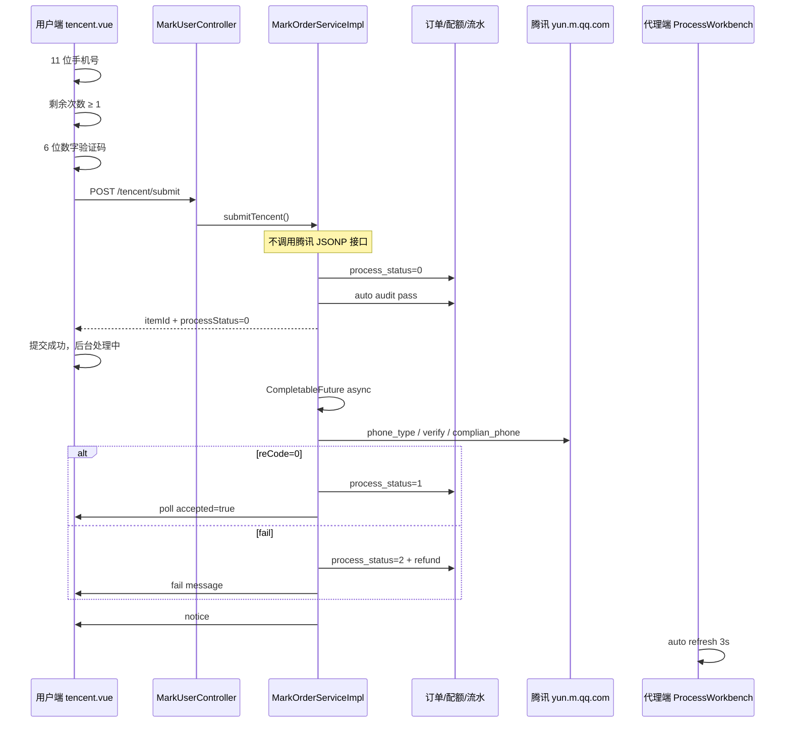

# 腾讯号码标记处理逻辑说明（TX）

> 文档生成时间：2026-07-06  
> 适用模块：号码标记管理系统 — 腾讯专用提交流程

---

## 1. 业务目标

用户在前端「腾讯」专用页提交 11 位手机号 + 6 位短信验证码，系统：

1. **提交时**：只校验格式与剩余次数，不调用腾讯 API
2. **建单后**：后台异步代用户调用腾讯官方接口完成申诉提交
3. **结果回传**：用户端轮询 + 站内消息，代理端列表自动刷新

---

## 2. 整体流程图



---

## 3. 用户端提交条件（仅三项）

| 顺序 | 校验项 | 前端 | 后端 |
|------|--------|------|------|
| 1 | 11 位手机号 | `tencent.vue` | `submitTencent` |
| 2 | 剩余次数 ≥ 1 | `remainCount < 1` | `createTencentUserSubmitOrder` |
| 3 | 6 位数字验证码 | regex | 同上 |

**明确不做的事（提交阶段）：**

- 不调用腾讯 JSONP 接口
- 不查询号码是否被标记
- 不校验验证码是否正确（由后台异步处理判定）

---

## 4. 后端核心入口

### 4.1 API 路由

| 方法 | 路径 | 说明 |
|------|------|------|
| POST | `/server/markUser/tencent/submit` | 用户提交手机号+验证码，创建订单 |
| GET | `/server/markUser/tencent/submit/result/{itemId}` | 用户轮询单条明细处理结果 |
| POST | `/server/markUser/tencent/status/query` | 号码实时状态查询（预查，非提交链路） |

控制器：`MarkUserController.java`

### 4.2 `submitTencent`

文件??`MarkOrderServiceImpl.java`

- 11 位手机号
- 6 位数字验证码
- `createTencentUserSubmitOrder()` ?? **不调用腾讯 JSONP 接口**

### 4.3 `createTencentUserSubmitOrder` ?? 建单与扣费

1. lock + deduct quota (`mark_user_platform_quota`)
2. wallet log DEDUCT
3. insert `mark_order` (audit auto pass)
4. insert `mark_order_item` (`remark` = smsCode, `process_status=0`)
5. `sendOrderSubmitNotice`
6. return `itemId`, schedule `scheduleTencentAutoProcess`

### 4.4 异步自动处理

`afterCommit` ?? `CompletableFuture` ?? `processTencentOrderItemAuto`

| step | action |
|------|--------|
| check | status=0, tencent platform, 6-digit remark |
| API | `executeTencentApiSubmit` |
| ok | status=1, processed_by=tencent-auto |
| fail | status=2, refund |
| end | refresh stats + notice |

### 4.5 腾讯 API调用链（仅后台自动处理时）

基址??`https://yun.m.qq.com`

| # | path | purpose |
|---|------|---------|
| 1 | `/core/sjg/moblie_phone_type` | phone_type |
| 2 | `/core/sjg/phone_complain_status` | complain status |
| 3 | `/core/txwz/get_phone_type` | verify code |
| 4 | `/core/txwz/complian_phone` | submit (reCode=0 success) |

---

## 5. 用户端结果回传

### 5.1 页面

`frontend/src/views/server/mark/user/tencent.vue`

- show pending message
- poll every 3s, max 40 times
- status 1 ?? 处理成功
- status 2 ?? 提交失败，验证码错误或者失效

### 5.2 站内消息

`sendTencentProcessNotice` ?? success / fail title + content

---

## 6. 代理端处理逻辑

### 6.1 页面

- route: `/mark/agent/process/platform?platformCode=tencent_mark`
- component: `ProcessWorkbench.vue`

### 6.2 腾讯订单特殊 UI

| status | UI |
|--------|-----|
| 0 | 后台处理中 |
| 1 | 已处理 ?? 处理成功 |
| 2 | 已处理 ?? 处理失败（通常已退款） |

auto refresh 3s when pending

### 6.3 禁止手动回填

`feedbackOrderItem` throws: 腾讯订单由后台自动处理，无需手动操作

---

## 7. 状态码与数据字段

### 7.1 `process_status`

| value | 含义 |
|-------|--------|
| `0` | 待处理（已建单，等待后台调腾讯 API） |
| `1` | 处理成功 |
| `2` | 处理失败（通常已退款） |

### 7.2 关键表字段

**mark_order_item**: phone, remark(smsCode), process_status, process_result, process_note, processed_by, refunded

**mark_order**: assigned_agent_id, audit_status=1, platform_code

---

## 8. 腾讯平台编码识别

```
tencent_mark | tencent | tx | txwz
```

- backend: `isTencentPlatformCode()`
- frontend: `markTencentPlatform.js`
- user route: `/mark/tencentMark`

---

## 9. 代理分配与订单可见性

`resolveAssignedAgentId`: creator agent ?? template agent ?? template owner

SQL visibility: assigned_agent_id OR template owner = current agent

---

## 10. 失败与退款

fail ?? status=2 ?? refund ?? user sees fail message

---

## 11. 相关文件索引

| 层级 | path | 职责 |
|------|------|------|
| 用户 | `frontend/.../tencent.vue` | submit + poll |
| API | `frontend/src/api/server/markUser.js` | REST |
| 代理 | `ProcessWorkbench.vue` | list + refresh |
| service | `MarkOrderServiceImpl.java` | core logic |
| script | `backend/sql/fix_tencent_vue_encoding.py` | UTF-8 vue |
| script | `backend/sql/regenerate_tencent_admin_ui.py` | regen vue |
| script | `backend/sql/fix_process_workbench.py` | agent UTF-8 |
| script | `backend/sql/fix_tx_md.py` | this doc |

---

## 12. 维护说明

### 12.1 修改用户页中文（Windows）

```bash
python backend/sql/fix_tencent_vue_encoding.py
python backend/sql/regenerate_tencent_admin_ui.py
python backend/sql/fix_process_workbench.py
python backend/sql/fix_tx_md.py
```

### 12.2 后端生效

rebuild + restart `geek-admin.jar` after Java changes

### 12.3 测试账号（参考）

| 角色 | 账号 | 密码 |
|------|------|------|
| 用户 | markuser | admin123 |
| 代理 | markagent | admin123 |

---

## 13. 与「状态查询」的区别

`queryTencentStatus` ?? precheck only, **not in submit flow**

---

## 14. 时序摘要（一句话）

> 用户校验手机号/次数/验证码 → 建单扣费（不调腾讯） → 事务提交后后台异步调腾讯四步接口 → 成功标记明细/失败退款 → 用户轮询与消息通知结果 → 代理端只读观察自动处理进度。
